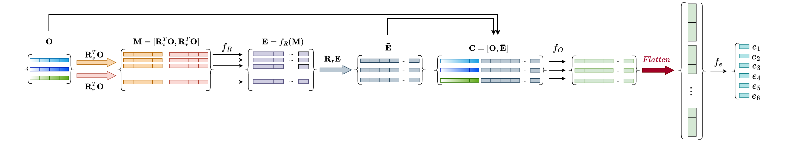
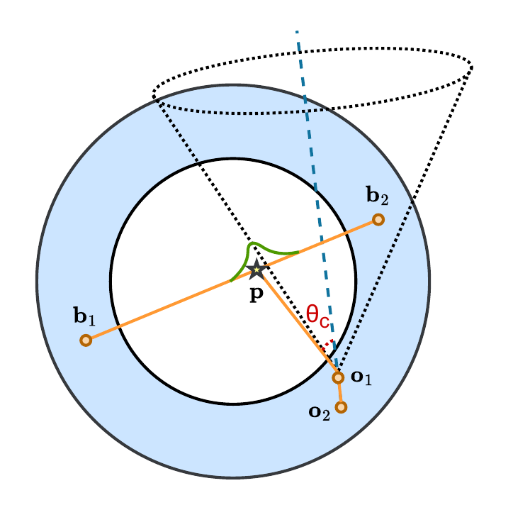
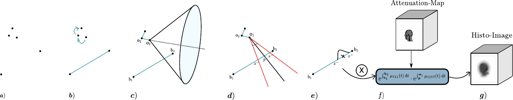
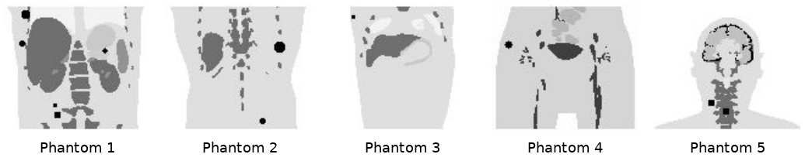
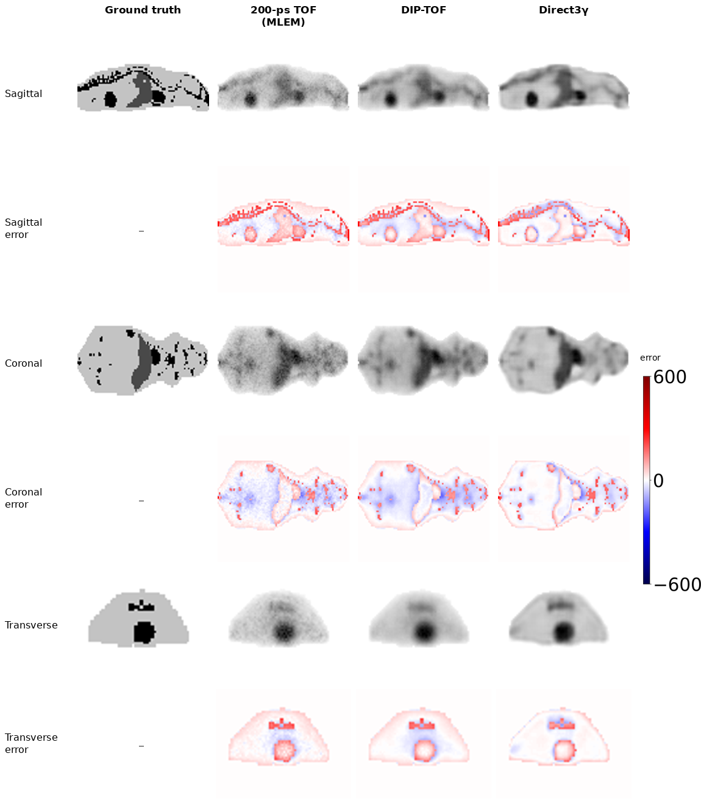

# Direct3γ: A Pipeline for Direct Three-Gamma PET Image Reconstruction

[](https://doi.org/10.1109/TRPMS.2025.3577810)
[](https://arxiv.org/abs/2407.18337)
[](LICENSE)

Official implementation of **"Direct3γ: A Pipeline for Direct Three-Gamma PET Image Reconstruction"**
(Y. Mellak, A. Bousse, T. Merlin, D. Giovagnoli, D. Visvikis — *IEEE Transactions on Radiation and Plasma Medical Sciences*, 2025).
The code goes from GATE Monte-Carlo simulations to 3D reconstructed images.

<p align="center">
  
</p>

<p align="center"><em>Direct3γ pipeline, from event detection, through the histogrammer that builds the histoimage (with the attenuation map), to the 3D U-Net backbone that reconstructs the final image.</em></p>

<p align="center">
  <br>
  <em>Same coronal slice of human-sized Phantom 1: ground truth → 200-ps TOF (MLEM) → DIP-TOF → Direct3γ.
  Also available as <a href="figures/direct3g_compare.webm">WebM</a>.</em>
</p>

## Contents

- [Overview](#overview)
- [Repository status: what is and is not included](#repository-status-what-is-and-is-not-included)
- [Method](#method)
- [Experiments](#experiments)
- [Results](#results)
- [Limitations](#limitations)
- [Repository layout](#repository-layout)
- [How to run](#how-to-run)
- [Differences between the paper and the released code](#differences-between-the-paper-and-the-released-code)
- [Citation](#citation)
- [License](#license)

## Overview

Three-gamma (3γ) PET uses radioisotopes such as ⁴⁴Sc that emit, almost simultaneously with the positron, an additional
prompt gamma (1157 keV for ⁴⁴Sc). Besides the two back-to-back 511-keV photons that define the usual line of response (LOR),
the third gamma Compton-scatters in the detector. Its first two interactions define a Compton cone, and the
intersection of that cone with the LOR gives an estimate of the emission point (the principle of a Compton camera).

Direct3γ is an event-by-event pipeline for 3γ PET reconstruction that addresses detector imperfections and the
uncertainty on the photon interaction points:

1. **Event detection and Compton cone construction**: the order of the prompt gamma's interactions is determined by a
   model trained on GATE Monte-Carlo data (the proposed *Modified Interaction Network*, MIN), which gives the first two
   interactions and hence the cone.
2. **LOR processing and histoimage generation**: energy and spatial uncertainties are propagated onto the LOR
   (non-symmetric Gaussian kernel), dual-energy attenuation correction (511 keV + 1157 keV) is applied, and a three-gamma
   histogrammer produces a *histoimage*.
3. **Image reconstruction and enhancement**: a 3D CNN (U-Net) trained with a supervised loss and an adversarial loss
   turns the histoimage into the final, deblurred and denoised image.

In simulations with human-sized and mouse-sized scanners, Direct3γ consistently outperforms conventional 200-ps TOF PET
(MLEM) and a DIP-processed version of it (DIP-TOF) in SSIM and PSNR.

## Repository status: what is and is not included

> **The MIN (photon interaction sequence determination) code is _not_ in this repository.**
> There is no implementation of the Modified Interaction Network, of the FCNN baseline or of the dφ-criterion here.
> Instead, `Python/Extract_detector_data.py` keeps the prompt-gamma interactions in the order recorded by GATE
> (the Monte-Carlo order, not an estimated one), and `Python/Build_Source_w_Uncertainties.py` uses the first two of them
> directly to build the Compton cone. The released pipeline therefore runs with an *oracle* sequence; the step where MIN
> belongs is marked in the [paper-to-code table](#paper-step--script-map).

Also not included: the TOF-MLEM and DIP-TOF baseline code, the mouse-sized scanner macros, the 400 XCAT training
phantoms, and trained MIN/FCNN weights. What *is* included: the GATE macros for the human-sized scanner and one example
phantom (`Phantom999`), the event-processing / histogrammer scripts, the SLURM launchers, the 3D U-Net + discriminator
code, trained generator weights (`3DReco/weights_gen_model_epoch_29.pth`) and one example histoimage
(`3DReco/Images/Simu999`).

## Method

### Photon interaction sequence determination

A prompt-gamma detection event is a set of *N* interactions of unknown order, **o**ₖ = (**r**ₖ, Eₖ), plus the two
back-to-back 511-keV hits **b**₁, **b**₂. Interacting *N* times gives *N*! possible paths. Only the first two
interactions are needed to draw the cone. The paper compares three ways of finding the sequence:

- **dφ-criterion** (physics-based): evaluates every possible sequence and minimises
  dφ = Σₖ (cos θₖ^kin − cos θₖ^geom)², where the kinematic angle comes from the Klein–Nishina/Compton formula
  cos θₖ^kin = 1 − m_e c² Eₖ₊₁ / (Eₖ (Eₖ − Eₖ₊₁)). It degrades with poor energy resolution and the minimum is not necessarily unique.
- **FCNN** (baseline from the literature): a fully-connected network over the normalised energies and positions with one
  output neuron per possible path (*N*! outputs). It works for *N* = 3–4 and degrades for larger *N*.
- **MIN** (proposed): a graph neural network built on Battaglia et al.'s *Interaction Network*. Each interaction is a
  node with four features (x, y, z, E); the fully-connected directed graph has *N*(*N*−1) edges, and sequence determination
  is cast as **edge classification**. The sender/receiver matrices build a message matrix, a relation network *f*_R (50-dim effects)
  encodes each edge, effects are aggregated per node, an object network *f*_O maps each node to 10 features, and an
  edge model *f*_E outputs a sigmoid score per edge. Edges below 0.5 are removed. It is trained with a binary cross-entropy loss
  on GATE simulations, and handles a variable number of interactions.

<p align="center">
  
</p>

<p align="center"><em>MIN: proposed architecture used to classify edges (relations between photon interactions) in the detector.</em></p>

Sequence-accuracy results from the paper (Experiment 1, simulated uniform ⁴⁴Sc water cylinder, 2 million test events):

| Approach | N = 3 | N = 4 | N = 5 | First two interactions only |
|---|---|---|---|---|
| dφ-criterion | 88 % | 73.5 % | 61 % | 79.8 % |
| FCNN | 91 % | 82 % | 59 % | 82.0 % |
| **MIN** | **93.5 %** | **92 %** | **77 %** | **87.7 %** |

Two-interaction events (≈30 % of events) are handled by taking the larger energy deposit as the first interaction
(≈81 % accuracy). MIN produced non-admissible graphs (V-structures, cycles) for 2 % of the events; they are counted as errors.

### Emission point from the Compton cone ∩ LOR

<p align="center">
  
</p>

<p align="center"><em>Estimating the point of emission using Compton kinematics. <b>b</b>₁ and <b>b</b>₂ are the detected positions of the
back-to-back annihilation photons; <b>o</b>₁ and <b>o</b>₂ are the first and second interaction positions of the prompt gamma.
The angle θ_c, from the Klein–Nishina formula, opens the Compton cone; the star is the true emission point <b>p</b>.</em></p>

With the first two interactions **o**₁, **o**₂, the initial energy E_init = 1.157 MeV and the energy E₁ deposited in the first
interaction, the cone apex is at **o**₁, its axis passes through **o**₂, and its half-angle θ_c comes from the Klein–Nishina
formula. The emission point **p** is the intersection of the cone with the LOR (**b**₁, **b**₂), i.e. the solution of
(**p** − **o**₁)·**n** / ‖**p** − **o**₁‖ = cos θ_c, with **n** the unit vector from **o**₂ to **o**₁. The equation can have two solutions
inside the field of view; both are kept (the false positives are handled by the CNN, see below).

### Propagation of energy and spatial uncertainty (DREP)

Detector imperfections (≈9 % FWHM energy resolution at 511 keV, finite spatial resolution) blur the estimate along the LOR.
The detector response error propagator (DREP) converts them into an uncertainty on θ_c:

- **Energy**: Δcos θ_c = |m_e c² / (E_init − E₁)²| · ΔE₁ and Δθ_c = Δcos θ_c / sin θ_c, with ΔE₁ from the Gaussian energy resolution.
- **Spatial**: the uniform position uncertainty of each interaction is propagated to the cone angle.

The cone is then opened/closed by ±Δθ_c, which moves its intersection with the LOR to **x**⁺ and **x**⁻. This gives
σ_energy^± and σ_spatial^±, combined by root-sum-of-squares:
σ_± = √((σ_energy^±)² + (σ_spatial^±)²). Because the crossing angle between cone and LOR and the cone-to-LOR distance matter,
the resulting distribution around **p** is **non-symmetric**: a Gaussian with σ₋ on one side and σ₊ on the other.

### Attenuation correction

For ⁴⁴Sc both the 511-keV annihilation photons and the 1157-keV prompt gamma are attenuated. The correction factor of each event is

a_**p** = exp(∫ from **b**₁ to **b**₂ of μ₅₁₁(**r**) d**r**) · exp(∫ from **p** to **o**₁ of μ₁₁₅₇(**r**) d**r**)

and is applied to the event's histo-function before the network, so the network learns the activity distribution instead of compensating for attenuation.

### Three-gamma histogrammer → histoimage

The histogrammer extends the TOF-PET "most likely annihilation position" histogrammer to 3γ events: for each event, the
attenuation-corrected non-symmetric Gaussian around **p** is drawn along the LOR in image space, and the histoimage is
the sum over all *K* events: **x**^hist = Σₖ **h**ₖ^att.

<p align="center">
  
</p>

<p align="center"><em>Workflow of the Direct3γ histogrammer: (a) detection of hits by the 3γ PET scanner; (b) construction of the LOR and determination
of the prompt-gamma interaction order; (c) estimation of the intersection between the Compton cone and the LOR; (d) calculation of
uncertainties on the LOR; (e) projection of the estimated Gaussian distribution onto the image space; (f) application of attenuation correction;
(g) the resulting histoimage.</em></p>

### 3D CNN with adversarial loss → final image

The histoimage still contains blur (from the DREP kernel), noise from false-positive intersections, and the effect of
sequence errors. A 3D U-Net *G* maps histoimages to the true emission image. It is trained as a conditional GAN
(Vox2Vox / pix2pix-style, with a patch discriminator and least-squares GAN loss) so that the output keeps high-frequency detail; the
supervised term keeps it faithful to the ground truth. Training uses random rigid augmentations (flips, rotations, translations) and intensity rescaling.

## Experiments

- **Simulation**: GATE v9.1 Monte-Carlo, ⁴⁴Sc source, two scanners:
  a **human-sized** liquid-xenon (LXe) TPC scanner inspired by the XEMIS series (inner/outer diameter 60/90 cm, ≈9 % FWHM energy
  resolution at 511 keV, 3.125 × 3.125 × 0.1 mm³ uniform position-uncertainty voxels), and the **mouse-sized** pre-clinical XEMIS scanner.
  For comparison, 200-ps TOF scanners were simulated: a Biograph mMR-like human scanner and a mouse-sized scanner with 1 × 1 × 10 mm³ LSO crystals,
  using the same phantoms and the same number of events.
- **Experiment 1 (sequence determination)**: MIN and FCNN trained on up to 20 million 3γ events from a uniform water cylinder filling the FOV
  (only fully absorbed prompt gammas, i.e. total deposit 1.157 MeV); separate models per number of interactions; 2 million separate test events.
- **Experiment 2 (image reconstruction)**: 400 anthropomorphic XCAT phantoms (200 × 200 × 200 voxels; 3 mm voxels for human-sized,
  0.8 mm for mouse-sized "mini-human" phantoms) with their 511-keV and 1157-keV attenuation maps and randomly placed spherical lesions;
  5 to 20 million 3γ events per phantom (randoms and scatter coincidences excluded). Test set: five human-sized phantoms
  (**Phantoms 1–5**) and five mouse-sized phantoms (a mouse phantom plus four mini-human XCAT phantoms).
- **Baselines**: MLEM (80 iterations) on 200-ps TOF data, and **DIP-TOF**, a deep-image-prior 3D U-Net (600 epochs, lr 10⁻³) applied to the TOF-MLEM image.
- **Metrics**: SSIM and PSNR against the ground-truth emission image; CNR, CRC and RC on five lesions of human Phantom 1.

<p align="center">
  
</p>

<p align="center"><em>Coronal views of the five human-sized test phantoms (Phantoms 1–5; 3 × 3 × 3 mm³ voxels) used in the test dataset.</em></p>

## Results

### Image quality

Direct3γ gives clearer anatomical detail and smaller errors than both baselines. TOF images are noisy; DIP-TOF reduces
noise but over-smooths structures. A contrast drop is observed in the upper vertebra of the human phantom.

<p align="center">
  
</p>

<p align="center"><em><b>Human-sized scanner (Phantom 1).</b> Comparison of 200-ps TOF, DIP-TOF and Direct3γ reconstructions against the
ground truth (GT), with the corresponding error maps (colour bar: ±600). The coronal GT shows the red spherical ROIs of the five lesions
(lesion 1: 6 mm; lesion 2: 4 mm; lesion 3: 6 mm; lesion 4: 6 mm; lesion 5: 8 mm) and the 6-mm-radius green background ROIs.</em></p>

<p align="center">
  
</p>

<p align="center"><em><b>Mouse-sized scanner.</b> Comparison of 200-ps TOF, DIP-TOF and Direct3γ reconstructions against the ground truth, with
error maps (same colour bar as above). Direct3γ is smoother with fewer and less intense errors, although some fine details of the GT are missing.</em></p>

### SSIM / PSNR over the five test phantoms of each scanner

| | Direct3γ (SSIM / PSNR) | 200-ps TOF (SSIM / PSNR) | DIP-TOF (SSIM / PSNR) |
|---|---|---|---|
| **Human-sized** | **0.9399 – 0.9721** / **26.15 – 35.40** | 0.8708 – 0.9475 / 25.74 – 34.37 | 0.8612 – 0.9390 / 26.53 – 34.82 |
| **Mouse-sized** | **0.9302 – 0.9354** / **25.31 – 26.77** | 0.8881 – 0.8913 / 22.36 – 23.03 | 0.8825 – 0.8895 / 22.90 – 23.50 |

Ranges are min–max over the five phantoms, as reported in the paper. DIP-TOF slightly improves PSNR over TOF through noise reduction, but its SSIM is
slightly lower (over-smoothing). On Phantom 1, lesion detectability is also better with Direct3γ
(e.g. CNR 48.7–112.7 vs 13.6–33.8 for TOF, depending on the lesion; see the paper's lesion-metrics table).
The slightly lower scores on the mouse-sized scanner are attributed to the smaller voxels (0.8 mm) and the uncorrected positron range.

## Limitations

- **MIN**: accuracy decreases for *N* > 5 interactions (combinatorial growth, *N*!); it occasionally outputs non-admissible graphs (2 %); it does not
  enforce Compton kinematics explicitly, and is sensitive to detector noise, especially when consecutive interactions deposit similar energy.
- **Isolated prompt gammas**: MIN assumes isolated prompt gammas, so it is not suited to high count rates where several photons interact within a short window;
  randoms and scatter coincidences were excluded from the simulated data.
- **Simulation-only, Monte-Carlo bias**: training relies on GATE simulations; real detectors (energy resolution, spatial uncertainty, Doppler broadening) may behave differently.
- **Adversarial loss**: GAN-based training can in principle hallucinate structures; none were found with known ground-truth phantoms, but thorough validation is needed
  before any clinical interpretation. The U-Net also depends on the count statistics it was trained on (transfer learning is a possible remedy).
- **Positron range** is not corrected, which limits small-animal imaging at 0.8 mm voxels.
- **This repository**: MIN is not included (see [above](#repository-status-what-is-and-is-not-included)), and the code contains hard-coded cluster paths.

## Repository layout

```
Gate/
  Simulations_macros/   GATE macros (scanner, physics, outputs) and a SLURM test script  -> Gate/Simulations_macros/ReadMe.md
  Phantoms/Phantom999/  Example voxelised phantom: activity, materials, 511/1157-keV attenuation maps, source/phantom macros
Python/                 Event extraction, emission-point + uncertainty estimation, backprojection, merging  -> Python/ReadMe.md
  Launcher/             SLURM job scripts that chain the steps above
3DReco/                 3D U-Net + discriminator, training and test scripts, trained weights, example data  -> 3DReco/ReadMe.md
figures/                Figures used in this README (derived from the paper)
requirements.txt        Python dependencies
```

More detail on each folder is in the existing sub-READMEs, which are not repeated here:
[`Gate/Simulations_macros/ReadMe.md`](Gate/Simulations_macros/ReadMe.md), [`Python/ReadMe.md`](Python/ReadMe.md) and [`3DReco/ReadMe.md`](3DReco/ReadMe.md).

## How to run

### Paper step → script map

| # | Paper step | Script / folder | Input → output |
|---|---|---|---|
| 1 | Monte-Carlo simulation of 3γ events (GATE, ⁴⁴Sc, voxelised XCAT phantom) | [`Gate/Simulations_macros/main_mMR.mac`](Gate/Simulations_macros/main_mMR.mac) (+ `mMR_scanner.mac`, `my_physics.mac`, `outputs_batch_01.mac`, phantom macros in `Gate/Phantoms/`) | phantom → `O_Simu/Out<S>/Sim_<n>.hits.npy` |
| 2 | Event selection: prompt gamma + two 511-keV photons, full absorption | [`Python/Extract_detector_data.py`](Python/Extract_detector_data.py) | `Sim_<n>.hits.npy` → `Detectors/Simu<S>/Detector_<n>.npy` |
| 3 | Ground-truth emission image (training target **x**\*) | [`Python/BuildEmissionSites.py`](Python/BuildEmissionSites.py) | `Sim_<n>.hits.npy` → `EmissionImages/Simu<S>/EmissionImage_<n>.bin` |
| – | **Photon interaction sequence determination (dφ / FCNN / MIN)** | **not in this repository**: step 2 keeps GATE's recorded order, which step 4 uses as if it were MIN's output | – |
| 4 | Emission point (Compton cone ∩ LOR) and propagation of energy/spatial uncertainty (DREP) | [`Python/Build_Source_w_Uncertainties.py`](Python/Build_Source_w_Uncertainties.py) | `Detector_<n>.npy` → `PSource_w_U/Simu<S>/PSource_w_U<n>.npy` |
| 5 | Attenuation correction + three-gamma histogrammer (histoimage) | [`Python/BP_w_Uncertainty.py`](Python/BP_w_Uncertainty.py) (+ `Gate/Phantoms/Phantom<S>/Attenuation_{511,1157}.bin`) | `PSource_w_U<n>.npy` → `BPImages/Simu<S>/BPUImage_wA_<n>.bin` |
| 6 | Sum the per-job sub-images of one simulation | [`Python/Merge_Images.py`](Python/Merge_Images.py) | sub-images → `3DImages/Simu<S>/BPUImage_wA_<S>.bin` and `EmissionImage_<S>.bin` |
| 7 | 3D CNN with adversarial loss → final image | [`3DReco/`](3DReco) (`Train_Direct3g_example_wAtt.py`, `Test_wAtt_Vox2Vox_no_norm3.py`, `model_vox2vox.py`, `DataLoading.py`) | histoimage + material map → reconstructed image |

`<S>` is the simulation/phantom number (`999` in the examples) and `<n>` the job index (one GATE job per `SLURM_ARRAY_TASK_ID`).
Images are 200 × 200 × 200 float32 volumes with 3 × 3 × 3 mm³ voxels (the emission image is 100 × 200 × 200 and is zero-padded to 200 along z by the training and test code).

### Prerequisites

- GATE (the launchers use a `gate_latest.sif` Singularity image) for step 1.
- Python 3 with `pip install -r requirements.txt` for steps 2–7 (the original runs used a PyTorch Singularity image). `pytorch-ssim` is only needed to import the training script.
- A GPU is recommended for training; the test example below also runs on CPU.

> **Hard-coded paths.** Every script and launcher uses absolute paths under `/homes/ymellak/Direct3G_f/` (the original cluster layout),
> and `main_mMR.mac` also points at `/homes/ymellak/Gamma3DataExtraction/XCatSimulations/Phantoms/Phantom{simu_number}/`
> (the files now live in `Gate/Phantoms/Phantom999/`). Before running anything, replace these prefixes with your own checkout, for example:
> ```bash
> ROOT=$(pwd)   # repository root
> grep -rIl "/homes/ymellak/Direct3G_f" Gate Python 3DReco | xargs sed -i "s#/homes/ymellak/Direct3G_f#$ROOT#g"
> ```
> The scripts also expect the output folders (`O_Simu/`, `Detectors/`, `EmissionImages/`, `PSource_w_U/`, `BPImages/`, `3DImages/`) to exist under that root;
> most launchers create their own `Simu<S>/` sub-folder.

### Step by step

Steps 1–6 take the GATE simulation of one phantom `<S>` to its histoimage; each Python script takes `<S>` and a job index `<n>` as arguments.

1. **Simulate** (paper: Monte-Carlo data generation). Edit `simu_number` in
   [`Gate/Simulations_macros/Test_Simulations.sh`](Gate/Simulations_macros/Test_Simulations.sh) and submit it (`sbatch`, array `1-5` by default), or run GATE directly:
   `Gate -a '[number,<n>][simu_number,<S>]' Gate/Simulations_macros/main_mMR.mac`.
   The macros model the human-sized LXe ring and the voxelised ⁴⁴Sc source of `Phantom<S>`. Details in [`Gate/Simulations_macros/ReadMe.md`](Gate/Simulations_macros/ReadMe.md).
2. **Extract the 3γ events**: `python Python/Extract_detector_data.py <S> <n>`.
   Keeps photons (PDG 22) whose event contains the prompt gamma and both 511-keV photons, requires full absorption (Σ deposit > 0.509 MeV for each 511-keV photon and > 1.14 MeV for the prompt gamma),
   and stores per event a `7 × 4` array of `(E, x, y, z)`: two rows for the 511-keV hits (E set to 0.511) and the first five prompt-gamma interactions in recorded order, zero-padded.
   *This is where MIN would reorder the prompt-gamma interactions.*
3. **Build the ground-truth emission image of the job**: `python Python/BuildEmissionSites.py <S> <n>`. Bins the true source positions of the events into a 3 mm voxel grid (training target).
4. **Estimate emission points with uncertainties**: `python Python/Build_Source_w_Uncertainties.py <S> <n>`.
   For every event it applies the detector uncertainties (Gaussian energy, uniform position), computes the Compton angle, intersects the cone with the LOR (up to two points, restricted to the LOR segment),
   and propagates energy and spatial uncertainty to get σ₋/σ₊ by moving the cone by ±Δθ_c. Each event is saved as `[b1, b2, p, s−, s+, e−, e+, o1]` (8 × 3 values).
5. **Back-project (histogrammer + attenuation correction)**: `python Python/BP_w_Uncertainty.py <S> <n>`.
   Combines σ_energy and σ_spatial by root-sum-of-squares, draws the LOR in a 200³ volume with the non-symmetric Gaussian around **p**, and multiplies each event by the
   511-keV (along the LOR) and 1157-keV (from **p** to **o**₁) attenuation factors read from `Gate/Phantoms/Phantom<S>/Attenuation_{511,1157}.bin`. Writes the per-job histoimage.
6. **Merge the per-job images** (paper: summing the events into one histoimage):
   `python Python/Merge_Images.py <S> <folder> <prefix> <size>`, e.g.
   `python Python/Merge_Images.py 999 BPImages/Simu999/ BPUImage_wA_ 200,200,200` for the histoimage and
   `python Python/Merge_Images.py 999 EmissionImages/Simu999/ EmissionImage_ 100,200,200` for the target.
   It sums all `<prefix>*.bin` of the folder, **deletes** them, and writes `3DImages/Simu<S>/<prefix><S>.bin`.
7. **Reconstruct with the 3D CNN** (see below).

#### 3D CNN (`3DReco/`)

The network is a 3D U-Net (`UNet3DWithAttenuation`) whose input is the histoimage concatenated with a one-hot encoding of a 4-class material map (`Materials_image.bin`: air, lung, bone, water),
trained with a patch discriminator (`Discriminator`, least-squares GAN loss + 25 × L1 loss, Adam, lr 5·10⁻⁴, batch size 2).

- **Test with the provided weights on the `Simu999` example.** `weights_gen_model_epoch_29.pth` is the generator checkpoint used for the example, and
  `3DReco/Images/Simu999/` holds the histoimage (`BPUImage_wA_999.bin`), the material map (`Materials_image.bin`) and the ground truth (`EmissionImage_999.bin`).
  After fixing the paths (see above; in `Test_wAtt_Vox2Vox_no_norm3.py` they point at the model, the input images and the output folder):
  ```bash
  cd 3DReco
  python Test_wAtt_Vox2Vox_no_norm3.py     # img_idx = 999, epoch = 29 are set in the script's __main__
  ```
  The prediction is written to `3DReco/test_results/Vox2VoxAtt_wo_norm_999.bin` (200³ float32; the emission volume is zero-padded by 50 slices on each side in z, so compare it with
  `EmissionImage_999.bin` after cropping `[50:150]`). On a 4-core CPU with 15 GB of RAM this example ran in about 15 s. `Test.sh` is the SLURM version of the same call.
- **Train.** `Train_Direct3g_example_wAtt.py` expects a `DataSet/` and a `ValDataSet/` folder, each containing one `Simu*/` sub-folder per phantom with
  `BPUImage_wA_*.bin`, `EmissionImage_*.bin` and `Materials_image.bin` (the output of steps 1–6); edit the dataset/save paths at the bottom of the script, then `python Train_Direct3g_example_wAtt.py`.
  Checkpoints are saved at every epoch (and training resumes from `gen_checkpoint.pth` if present). `DataLoading.py` applies random flips and translations.
  **Known issue:** the script imports `SimulationDatasetAttenuation2_wo_norm` from `DataLoading.py`, but that file only defines `SimulationDatasetAttenuation` (and two older classes),
  so training fails with an `ImportError` as released. Nothing has been changed in the code logic.

### SLURM launchers (`Python/Launcher/`)

These scripts were used on an HPC cluster (SLURM + Singularity) to run steps 1–6 as job arrays of up to 1000 jobs (one per `<n>`). Partition names, container images (`gate_latest.sif`, `pytorch.sif`),
the user name and paths are specific to that cluster and must be adapted. The simulation number is passed as the environment variable `simu_number` (`sbatch --export=ALL,simu_number=<S> …`).
General notes are in [`Python/ReadMe.md`](Python/ReadMe.md); in the order of the pipeline:

| Script | Runs | Notes |
|---|---|---|
| `Gate_Launcher.sh` | GATE (`main_mMR.mac`) in the Singularity image, array `1-1000` | step 1; writes `O_Simu/Out<S>/` |
| `BuildDetectors.sh` | `Extract_detector_data.py <S> $SLURM_ARRAY_TASK_ID` | step 2; creates `Detectors/Simu<S>/` |
| `BuildEmissionSite.sh` | `BuildEmissionSites.py <S> $SLURM_ARRAY_TASK_ID` | step 3; creates `EmissionImages/Simu<S>/` |
| `Estimate_w_U.sh` | `Build_Source_w_Uncertainties.py <S> $SLURM_ARRAY_TASK_ID` | step 4; creates `PSource_w_U/Simu<S>/` |
| `BPImages.sh` | `BP_w_Uncertainty.py <S> $SLURM_ARRAY_TASK_ID` (6 CPUs per task) | step 5; creates `BPImages/Simu<S>/` |
| `MergeImages.sh` | `Merge_Images.py` for `Workon=BPImages` (200³, prefix `BPUImage_wA_`) or `Workon=EmissionImages` (100×200×200, prefix `EmissionImage_`) | step 6; creates `3DImages/Simu<S>/` |
| `PipeLineLauncherLoop.sh <S>` | Orchestrates one simulation: submits the jobs above in order with `--dependency=afterany`, and cancels GATE/extraction array tasks that run longer than `max_runtime` (600 s) | the script's comment says "18 minutes" but the value is 600 s |
| `LoopLauncher.sh` | Loops over simulation numbers (`{999..999}` as released), waits until none of the user's other jobs are running on the CPU partitions, then calls `PipeLineLauncherLoop.sh` | submit it with `sbatch`; edit the loop range to process several phantoms |

Typical use on a cluster: adapt the paths and partitions, then `sbatch Python/Launcher/LoopLauncher.sh` (or `bash Python/Launcher/PipeLineLauncherLoop.sh <S>` for a single phantom).
Without SLURM, run the scripts of steps 2–6 yourself in a loop over `<n>`.

> Only the 3D CNN test on `Simu999` (step 7) was executed while writing this README. Steps 1–6 need GATE output (`Sim_<n>.hits.npy`), which is not shipped with the repository.

## Differences between the paper and the released code

- **MIN / FCNN / dφ-criterion are not included**; the released pipeline uses GATE's recorded interaction order (see [status](#repository-status-what-is-and-is-not-included)).
- **Physics list**: the paper reports `emstandard_opt3`; `Gate/Simulations_macros/my_physics.mac` enables `emstandard_opt4` (opt3 is commented out).
- **Scanner geometry**: the paper describes a 60/90-cm (inner/outer diameter) human-sized LXe scanner; `mMR_scanner.mac` defines a LXe cylinder with R<sub>min</sub> = 32.8 cm, R<sub>max</sub> = 100.8 cm and a height of 80 cm. Check it against the paper before reusing it.
- **Mouse-sized scanner**: no macros are provided, and the image grid (200³ at 3 mm voxels) is hard-coded in the Python scripts, whereas the paper's mouse-sized experiments use 0.8 mm voxels.
- **Detector-uncertainty constants** are hard-coded in `Build_Source_w_Uncertainties.py`: 5 % FWHM Gaussian energy noise on the 1.157-MeV scale, a uniform 0.5-mm position jitter, and a 3-mm uniform position uncertainty in the cone-angle error propagation.
  The paper describes ≈9 % FWHM at 511 keV and a 3.125 × 3.125 × 0.1 mm³ voxel model; the appendix uses a roughly constant spatial angular error of 1.2°, whereas the code computes the spatial term by geometric error propagation.
- **`Build_Source_w_Uncertainties_AllPossibilities.py`** is currently an identical copy of `Build_Source_w_Uncertainties.py`.
- **Not provided**: the TOF-MLEM and DIP-TOF baseline code, the 400 XCAT phantoms, and the MIN/FCNN training data and weights. Only `Phantom999` and one example histoimage are included.

## Citation

If you use this code, please cite:

```bibtex
@article{mellak2025direct3gamma,
  title   = {Direct3$\gamma$: A Pipeline for Direct Three-Gamma {PET} Image Reconstruction},
  author  = {Mellak, Youness and Bousse, Alexandre and Merlin, Thibaut and Giovagnoli, Debora and Visvikis, Dimitris},
  journal = {IEEE Transactions on Radiation and Plasma Medical Sciences},
  year    = {2025},
  doi     = {10.1109/TRPMS.2025.3577810},
  eprint  = {2407.18337},
  archivePrefix = {arXiv}
}
```

The authors are affiliated with LaTIM, Inserm UMR 1101, Université de Bretagne Occidentale, Brest, France. This work received French government support granted to the Cominlabs excellence laboratory and managed by the French National Research Agency (ANR) in the "Investing for the Future" program under reference ANR-10-LABX-07-01.

## License

Released under the [MIT License](LICENSE) © Youness Mellak.
