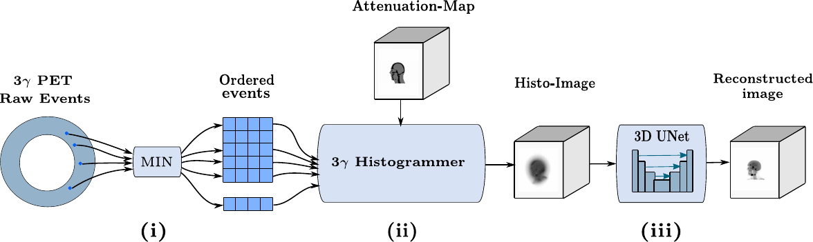
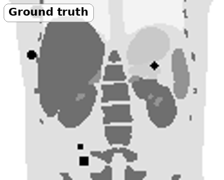
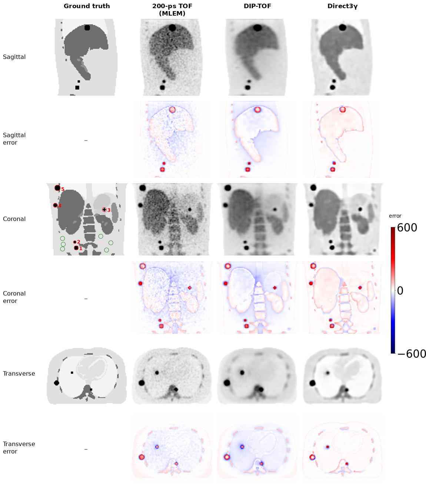

# Direct3γ: Direct Three-Gamma PET Image Reconstruction

[](https://doi.org/10.1109/TRPMS.2025.3577810)
[](https://arxiv.org/abs/2407.18337)
[](LICENSE)

Code for the paper *Direct3γ: A Pipeline for Direct Three-Gamma PET Image Reconstruction*.
The code goes from GATE simulations to 3D images.

<p align="center">
  
</p>

<p align="center">
  <br>
  <em>Same slice: ground truth, 200-ps TOF, DIP-TOF, Direct3γ.</em>
</p>

> **MIN is not in this repository.**
> MIN is the network that finds the order of the photon interactions.
> The code here uses the order that GATE records.
> The FCNN and dφ-criterion code is also not included.

## What it does

Some isotopes (for example ⁴⁴Sc) emit a third gamma (1157 keV) with the positron.
The third gamma scatters in the detector. Its first two interactions give a Compton cone.
The cone and the line of response (LOR) cross at the emission point.

The pipeline has three stages:

1. **Order the interactions.** MIN finds the order of the third-gamma interactions. It is a graph network trained on GATE data.
2. **Make the histoimage.** The code finds the emission point on the LOR.
   It propagates the energy and position errors onto the LOR (non-symmetric Gaussian).
   It corrects attenuation at 511 keV and 1157 keV. It sums all events.
3. **Make the final image.** A 3D U-Net trained with an adversarial loss removes blur and noise.

## Results

The paper tests human-sized and mouse-sized scanners in simulation.
Direct3γ is better than 200-ps TOF PET (MLEM) and DIP-TOF.
Values are the range over five test phantoms.

| Scanner | Method | SSIM | PSNR (dB) |
|---|---|---|---|
| Human | **Direct3γ** | **0.940 – 0.972** | **26.2 – 35.4** |
| Human | TOF | 0.871 – 0.948 | 25.7 – 34.4 |
| Human | DIP-TOF | 0.861 – 0.939 | 26.5 – 34.8 |
| Mouse | **Direct3γ** | **0.930 – 0.935** | **25.3 – 26.8** |
| Mouse | TOF | 0.888 – 0.891 | 22.4 – 23.0 |
| Mouse | DIP-TOF | 0.883 – 0.890 | 22.9 – 23.5 |

<p align="center">
  <br>
  <em>Human-sized scanner, Phantom 1. Each error row shows the error against the ground truth.</em>
</p>

More figures are in [`figures/`](figures): mouse results, phantoms, MIN architecture, cone and LOR, histogrammer.

## Limitations

- MIN is less accurate when a gamma has more than 5 interactions.
- MIN works only for isolated gammas. It does not work at high count rates.
- The data are simulated. Real detectors can give different results.
- A GAN can add false structures. Validate the results before clinical use.
- The code does not correct the positron range. This limits small-animal imaging.
  Two other works in my thesis address the positron range:
  [Particles_Tracking_GAN](https://github.com/Mellak/Particles_Tracking_GAN) (fast GAN simulation of positron paths) and
  [DDConv](https://github.com/Mellak/ddconv-prc) (positron range correction in image reconstruction; code coming soon).

## How to run

Each paper step has one script. `<S>` is the phantom number (999 in the example). `<n>` is the job number.

| Step | Paper | Script | Output |
|---|---|---|---|
| 1 | GATE simulation | `Gate/Simulations_macros/main_mMR.mac` | `Sim_<n>.hits.npy` |
| 2 | Select 3γ events | `Python/Extract_detector_data.py <S> <n>` | `Detector_<n>.npy` |
| 3 | Ground-truth image | `Python/BuildEmissionSites.py <S> <n>` | `EmissionImage_<n>.bin` |
| – | **Interaction order (MIN)** | **Not included** | – |
| 4 | Emission point and uncertainty | `Python/Build_Source_w_Uncertainties.py <S> <n>` | `PSource_w_U<n>.npy` |
| 5 | Attenuation correction and histogrammer | `Python/BP_w_Uncertainty.py <S> <n>` | `BPUImage_wA_<n>.bin` |
| 6 | Sum the images of all jobs | `Python/Merge_Images.py` | `BPUImage_wA_<S>.bin` |
| 7 | 3D CNN | `3DReco/` | final image |

**Before you start**

1. Install the packages: `pip install -r requirements.txt`.
2. Change the paths. All scripts use `/homes/ymellak/Direct3G_f`. Replace it with your folder:
   ```bash
   grep -rIl "/homes/ymellak/Direct3G_f" Gate Python 3DReco | xargs sed -i "s#/homes/ymellak/Direct3G_f#$(pwd)#g"
   ```
3. Make the output folders (`O_Simu`, `Detectors`, `EmissionImages`, `PSource_w_U`, `BPImages`, `3DImages`).

**Steps 1 to 6** use GATE and Python.
- `Python/Launcher/*.sh` run these steps on a SLURM cluster.
  Change the paths and partitions first. Then run `sbatch Python/Launcher/LoopLauncher.sh`.
- Step 6 deletes the single-job images after it adds them.
- Details: [`Gate/Simulations_macros/ReadMe.md`](Gate/Simulations_macros/ReadMe.md) and [`Python/ReadMe.md`](Python/ReadMe.md).

**Step 7: test the 3D CNN.** Use the example `3DReco/Images/Simu999` and the weights `weights_gen_model_epoch_29.pth`.
```bash
cd 3DReco
python Test_wAtt_Vox2Vox_no_norm3.py
```
The result is `3DReco/test_results/Vox2VoxAtt_wo_norm_999.bin`. It takes about 15 s on a CPU.
The script pads the volume by 50 slices on each side in z. Crop `[50:150]` to compare it with `EmissionImage_999.bin`.

**Step 7: train the 3D CNN.** Run `python Train_Direct3g_example_wAtt.py`. Details: [`3DReco/ReadMe.md`](3DReco/ReadMe.md).
> **Known problem:** the training script imports `SimulationDatasetAttenuation2_wo_norm`.
> `DataLoading.py` does not define this class, so training stops with an `ImportError`.

## Citation

```bibtex
@article{mellak2025direct3gamma,
  title   = {Direct3$\gamma$: A Pipeline for Direct Three-Gamma {PET} Image Reconstruction},
  author  = {Mellak, Youness and Bousse, Alexandre and Merlin, Thibaut and Giovagnoli, Debora and Visvikis, Dimitris},
  journal = {IEEE Transactions on Radiation and Plasma Medical Sciences},
  year    = {2025},
  doi     = {10.1109/TRPMS.2025.3577810}
}
```

## Acknowledgements

This work was done at LaTIM, Inserm UMR 1101, Université de Bretagne Occidentale, Brest, France.
It received French government support granted to the Cominlabs excellence laboratory.
The French National Research Agency (ANR) manages this support in the "Investing for the Future" program (ANR-10-LABX-07-01).

## License

[MIT](LICENSE) © Youness Mellak
